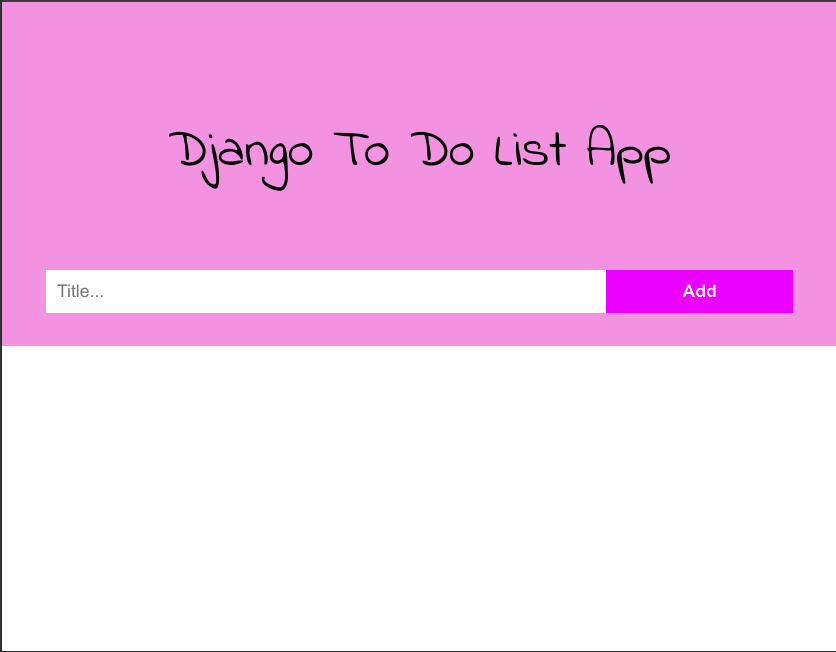
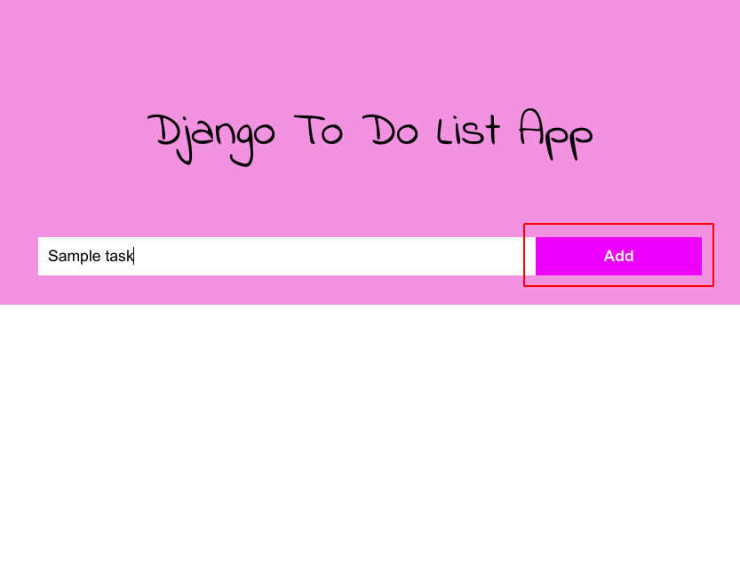
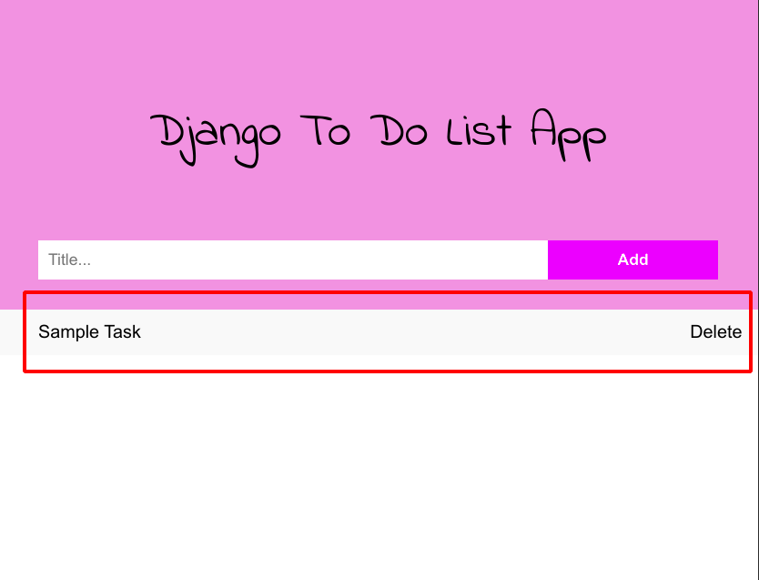
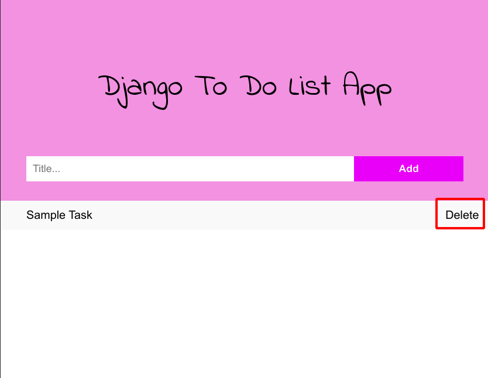

# To Do List App in the Django Web Development Framework


A heroku deployment to the Django App can be found at http://djangogetitdone.herokuapp.com/


### The Home Page to access the screen shots
#### This is the main static page serverd by the [index.html](templates/index.html) file served in the templates folder



## Steps to operate
### Type the title of the task in the Title text box and press Add to add a task to the list.

### A task will now appear

### Delete the task if you wish to using the delete button



## Backend details
API end points available
```
/ 

The main display endpoint that reders the page template and displays all current tasks in the database


/delete/<str:pk>

Deletes a particular item from the database and redirects to "/" 
```

## Tasks to be done on this project:
- [ ] Add authetication on the backend, to redirect to a 404 if the user goes to a random URL.
- [ ] Add login  system and allow user to create private boards.